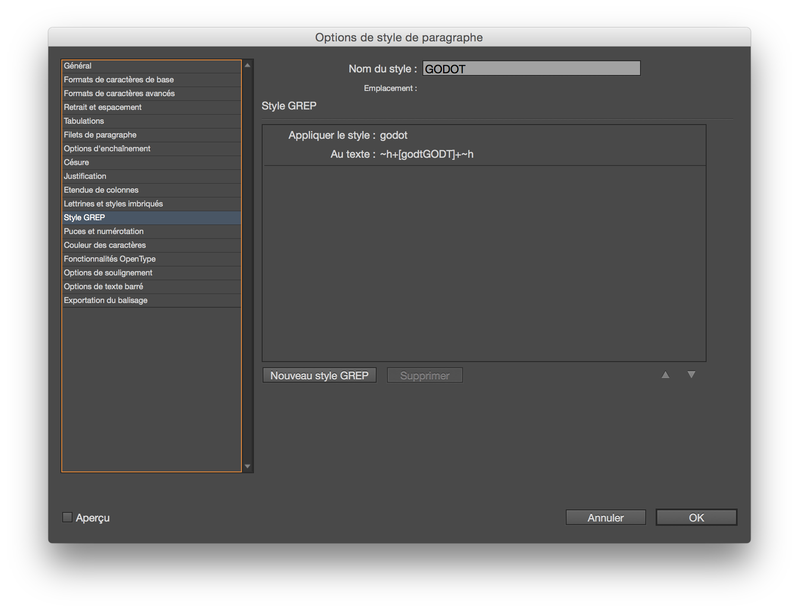

# Clara - En attendant Godot #

> Mon texte est le début de la pièce de théâtre En Attendant Godot de Samuel Beckett. 
Le premier traitement du texte consiste à repérer toutes les fois que la suite de lettres g - o - d - o - t apparaît dans le texte, sans tenir compte de la casse. <

Il faut replacer le ficher de script godot.jsx dans le dossier user de BasilJS (dans in design, dans la palette de script, faire apparaître dans le finder le dossier script et copier le fichier dedans).

Dans inDesign créer un style de caractère « godot », qui correspondra au style des caractères g - o - d - o - t.

Créer un style de paragraphe pour le texte courant. Au sein de ce style de paragraphe créer un style GREP qui permettra d'appliquer le style de caractère « godot » précédemment créé. On cherchera les caractères suivants : 

```~h+[godtGODT]+~h```



Ce qui veut dire que l'on cherche tous les caractères g-o-d-t-G-O-D-T qui sont encadrés par le caractère caché indesign « fin de style imbriqué ».

Double cliquer sur le script (il est commenté), à l'éxecution il cherchera toutes les séquences de lettres g-o-d-o-t (en minuscules ou majuscules), qui se suivent. Chaque caractère trouvé, sera encadré avec le caractère masqué de « fin de style imbriqué ».
